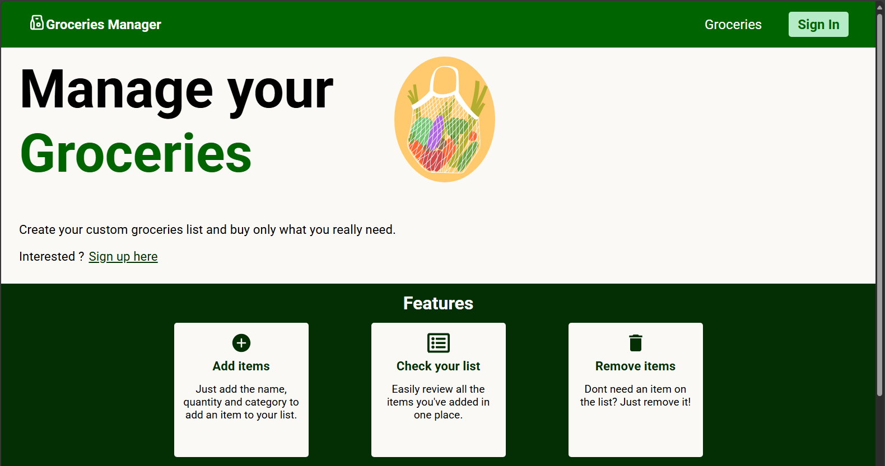
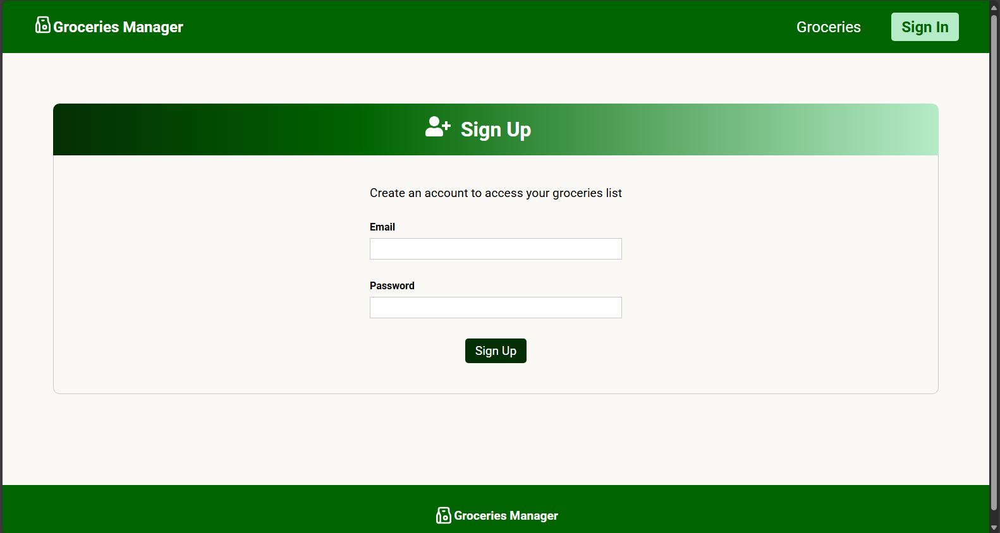
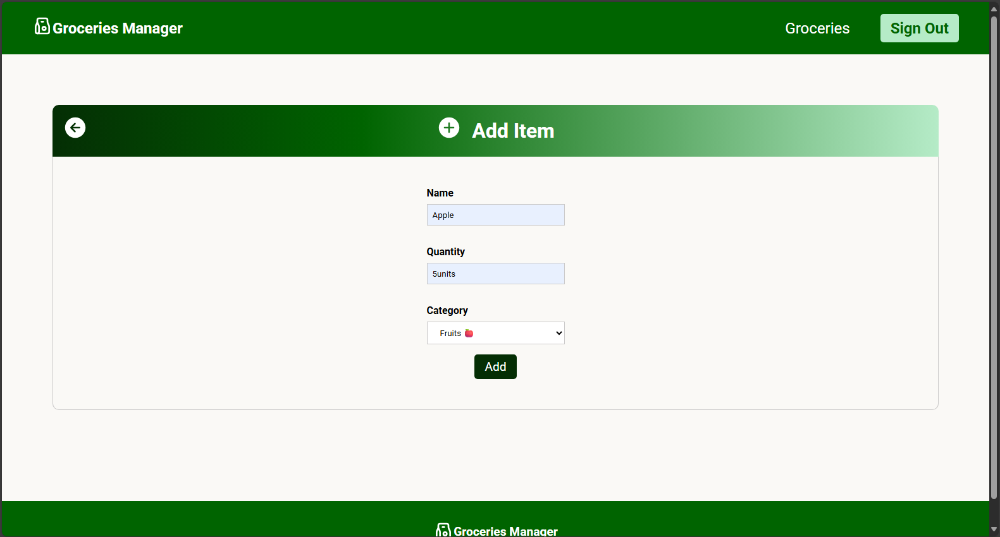
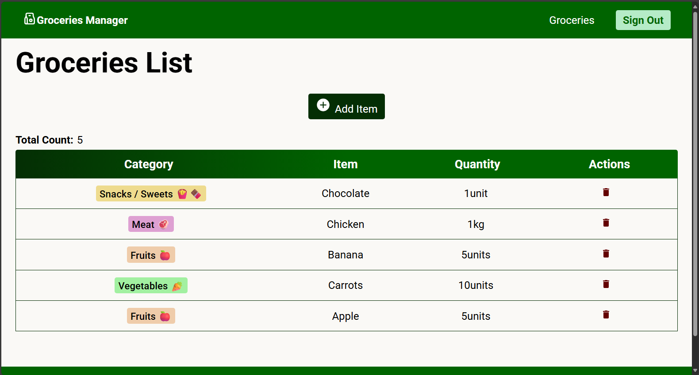
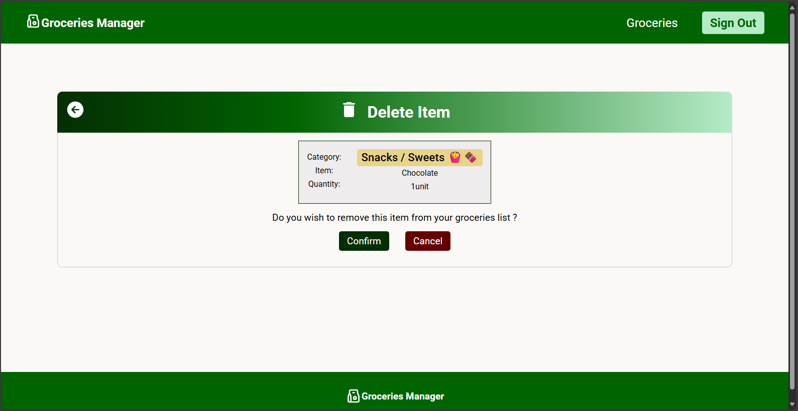

# Groceries Manager

Welcome to groceries manager project. This project was built using **Vite** and **React 19**.

**User Sign Up** - before acessing the groceries manager features, users need to sign up first

## Features

**Add items** - where users can add items to their grocery list

**Grocery List** - where users can consult their grocery list

**Delete items** - where users can delete a specific grocery list item

# Depedencies

- **vite**: build tool and development server.
- **react 19**: used for building User Interfaces without refreshing the page.
- **react-router-dom**: used for routing.
- **firebase**: used for user authetication and real-time database.
- **react-icons**: used for the different icons from popular icon libraries (e.g. Font Awesome).
