# Groceries Manager

Welcome to **groceries manager** project ! This website allows users to create grocery lists and manage their items.

This project was built using **Vite** and **React 19**.

**Home page**

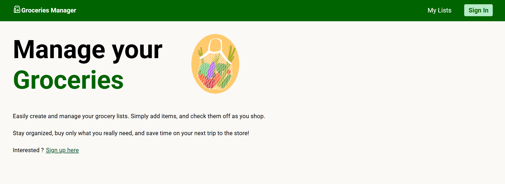

**_Home page Features Section_** - In the features section, users can explore the main functionalities of the Groceries Manager.

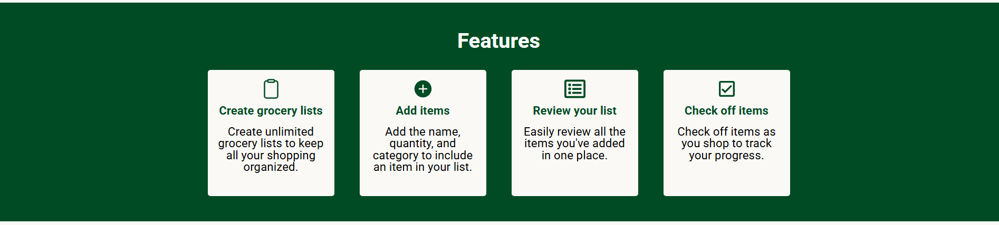

 

**Responsive Pages** - This project was built with responsive pages in mind.

**_Home Page on Small Screen_**

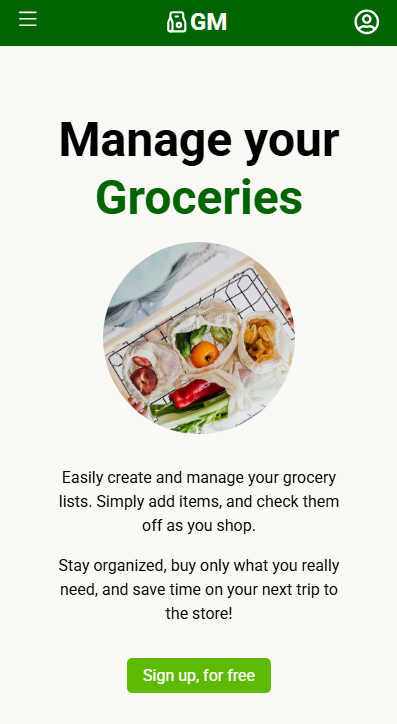

**_Menu on Small Screen_**

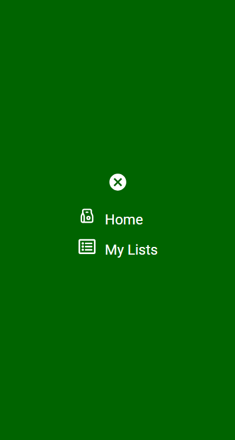

**_Groceries List on Small Screen_**

 

**Error Pages**

**_Error Page_** - this page is displayed when a user attempts an action on the website, but an error occurs.

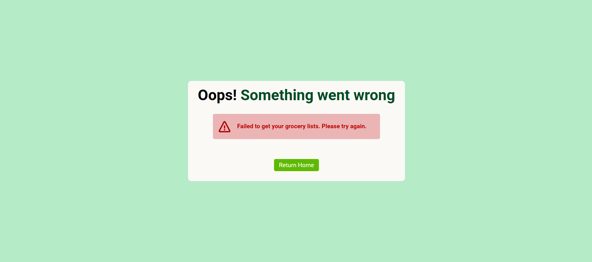

**_Not Found Page_** - this page is displayed when a user attempts to navigate to a URL that doesn't exist or is unavailable within the website.

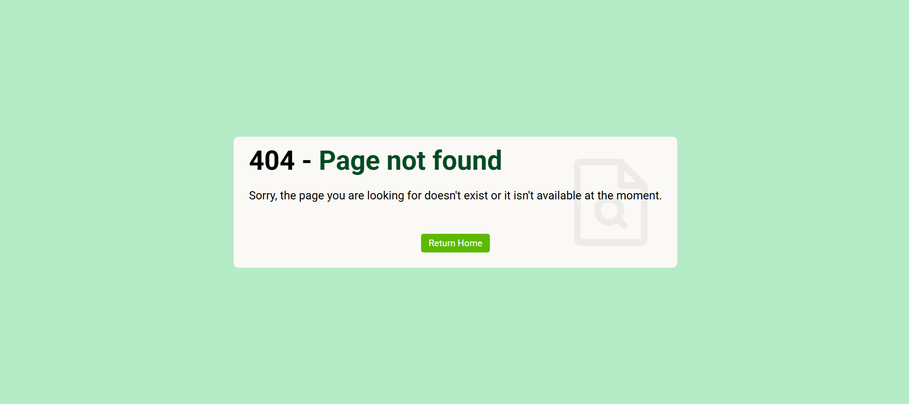

 

**User Sign Up** - to access the features of Groceries Manager, user must first sign up.

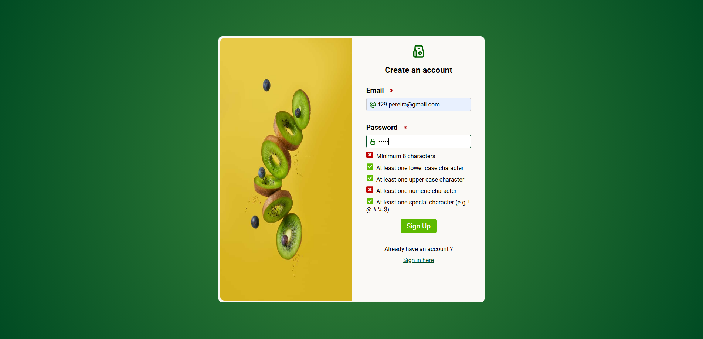

## Features

**Grocery lists** - after successful authentication, the user will be redirected to the "My Lists" page, where they can view existing lists and add new ones.

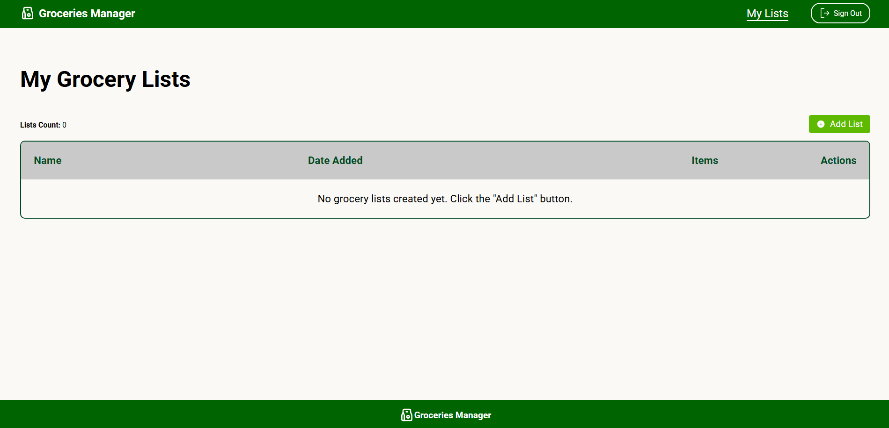

**Add Groceries list** - to create a new groceries list, user must fill out the "Name" field.

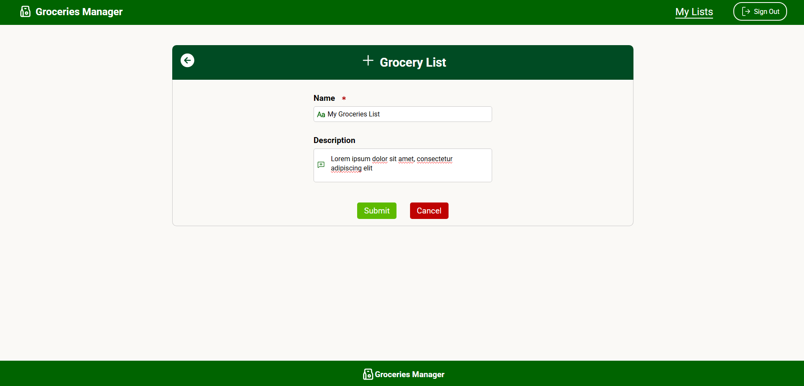

**Groceries list Actions** - after successfully adding a new grocery list, the user will be redirected to the "My Lists" page. A success notification will appear, and the user can view or delete the list through the "Actions" column in the table.

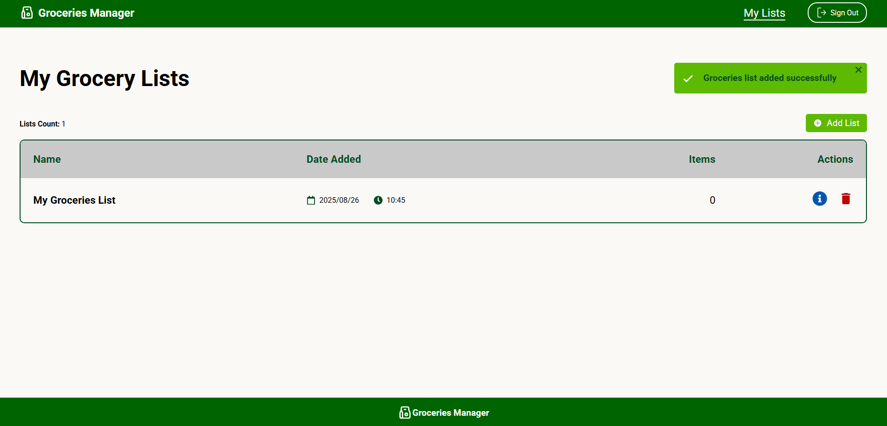

**Delete groceries list**

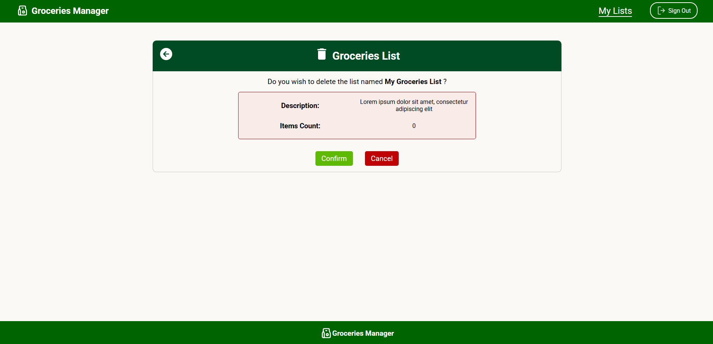

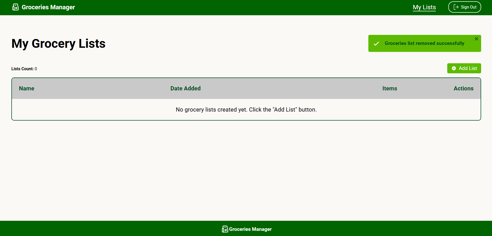

 

**View Groceries List** - on the groceries list page, users can edit the name/description of the list and manage the items

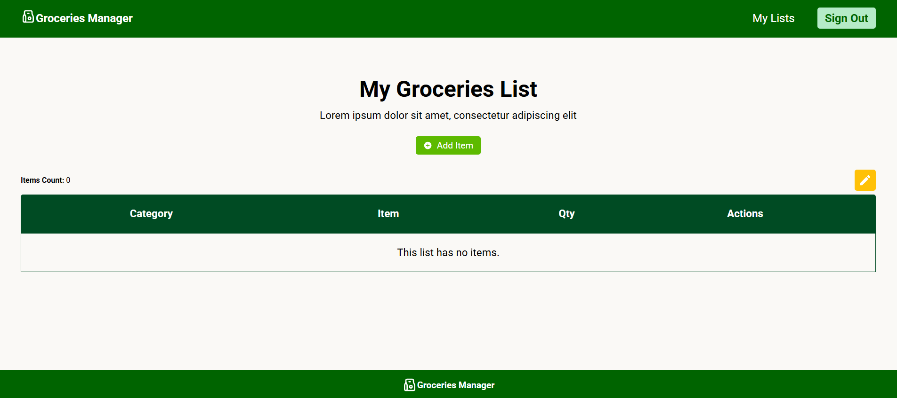

**Add items** - to add a new item users must fill out the name, quantity and categories fields.

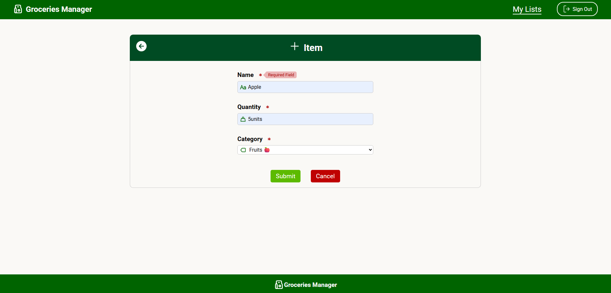

**Groceries List with Item** - after successfully adding an item, the user will be redirected to the Groceries List page. A success notification will appear, and the user can manage the item through the "Actions" column in the table.

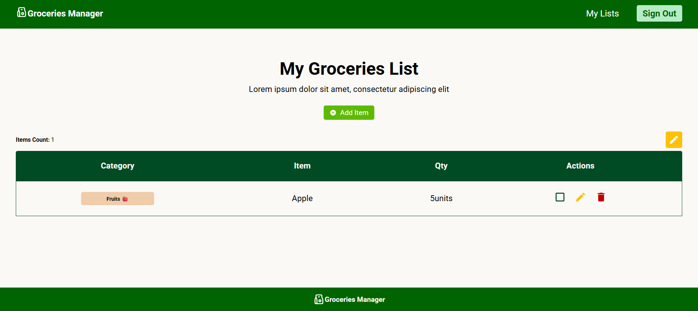

**_Item Actions_**

**Check Item** - users can check off items to track their shopping progress. If needed users can uncheck them as well.

**Edit Item** - users can edit item´s data, if the item is unchecked.

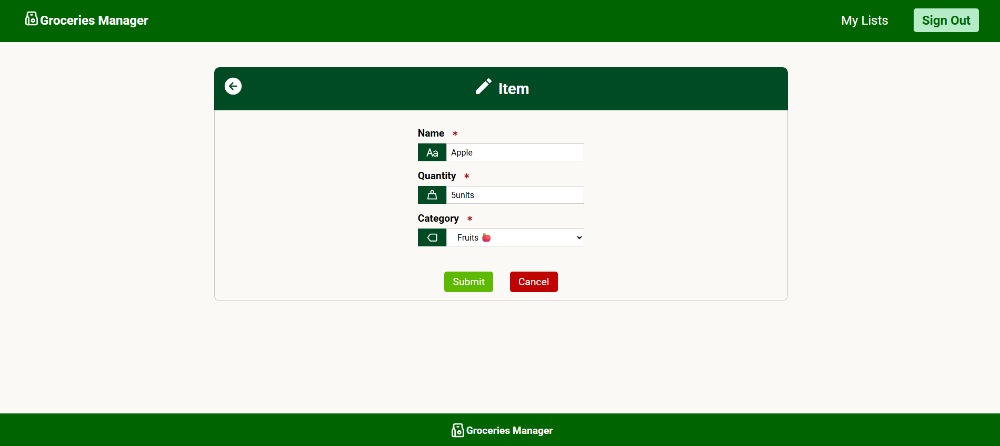

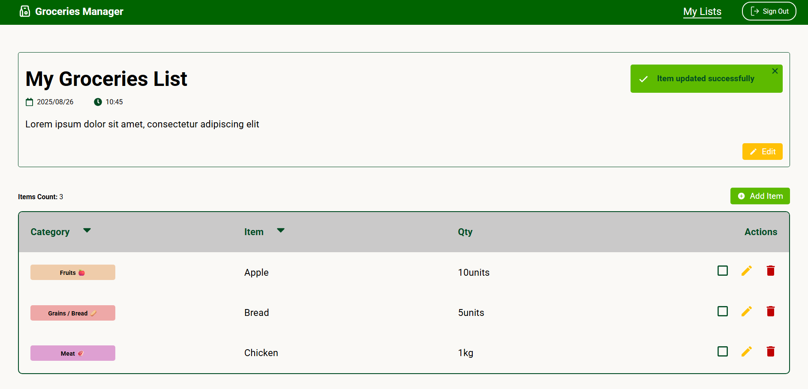

**Remove Item** - users can remove an item from a groceries list, if the item is unchecked.

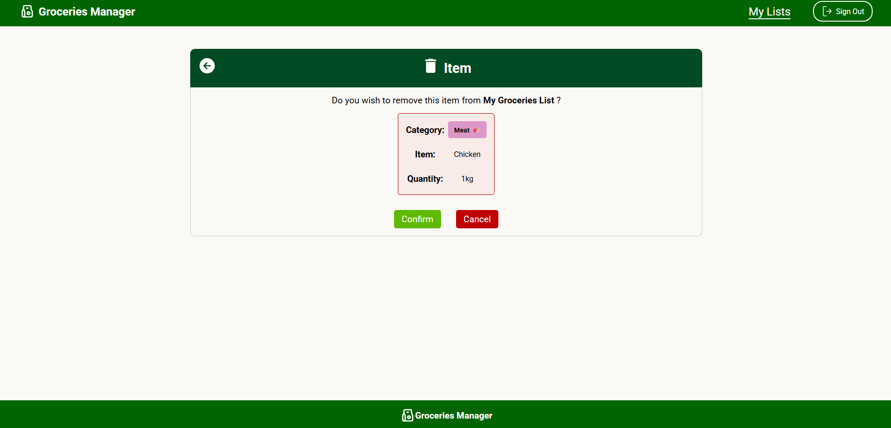

 

# Dependencies

- **vite**: build tool and development server.
- **react 19**: used for building User Interfaces without refreshing the page.
- **react-router-dom**: used for routing.
- **firebase**: used for user authetication and real-time database.
- **react-icons**: used for the different icons from popular icon libraries (e.g. Font Awesome).
