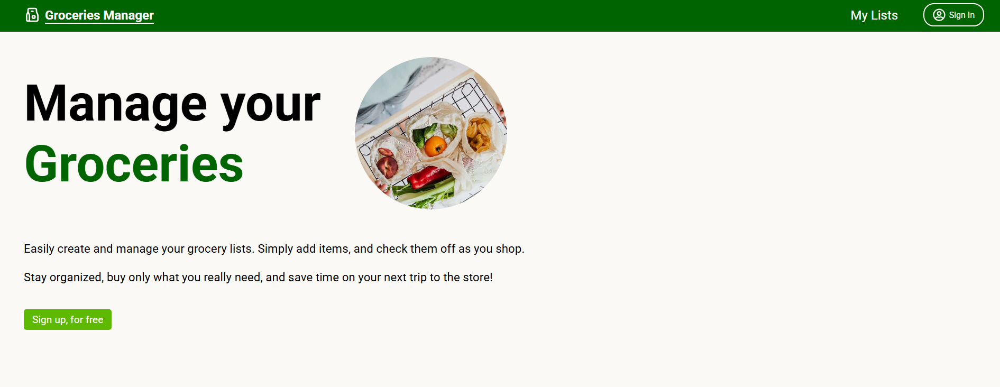
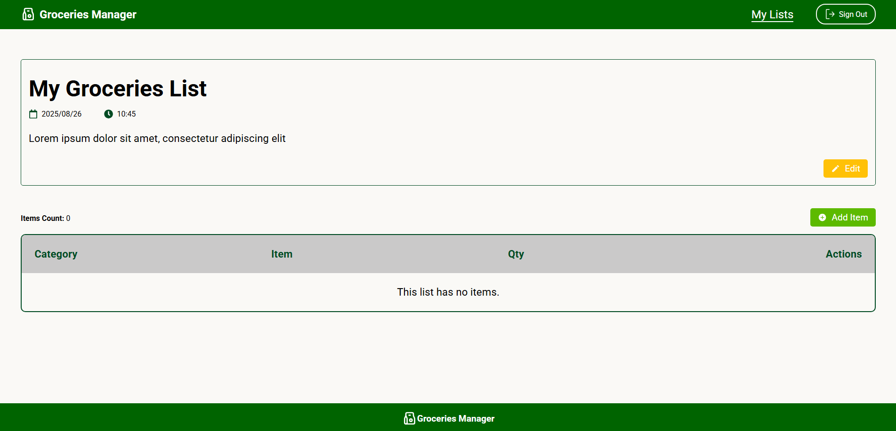
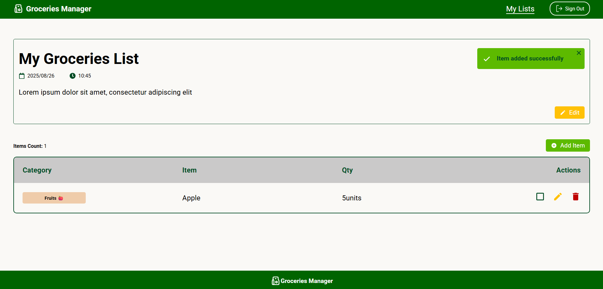
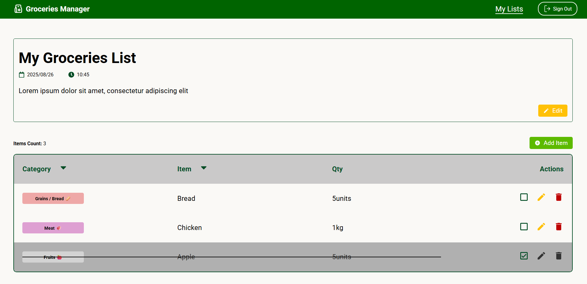
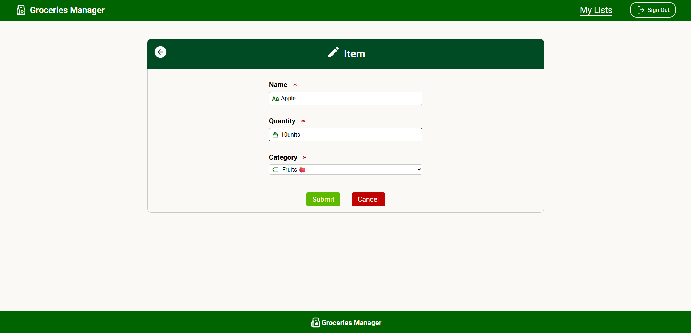

# Groceries Manager

Welcome to **groceries manager** project ! This app allows users to create grocery lists and manage their items.

This project was built using **Vite** and **React 19**.

**Home page**

**_Home page Features Section_** - In the features section, users can explore the main functionalities of the Groceries Manager.

 

**Responsive Pages** - This project was built with responsive pages in mind.

**_Home Page on Small Screen_**

**_Groceries List on Small Screen_**

 

**User Sign Up** - to access the features of Groceries Manager, users must first sign up.

## Features

**Grocery lists** - after successful authentication, users will be redirected to the "My Lists" page, where they can view existing lists and add new ones.

**Add Groceries list** - to create a new groceries list users must fill out the name field.

**Groceries list Actions** - after sucessfully adding a new groceries list, users can view or delete the list in the "Actions" table column".

**Delete groceries list**

 

**View Groceries List** - on the groceries list page, users can edit the name/description of the list and manage the items

**Add items** - to add a new item users must fill out the name, quantity and categories fields.

**Groceries List with Item** - after sucessfully adding an item the user will be redirected to the groceries list page.

**Check Item** - users can check off items to track their shopping progress. If needed users can uncheck them as well.

**Edit Item** - users can edit item data.

**Remove Item** - users can remove an item from a groceries list.

# Dependencies

- **vite**: build tool and development server.
- **react 19**: used for building User Interfaces without refreshing the page.
- **react-router-dom**: used for routing.
- **firebase**: used for user authetication and real-time database.
- **react-icons**: used for the different icons from popular icon libraries (e.g. Font Awesome).
